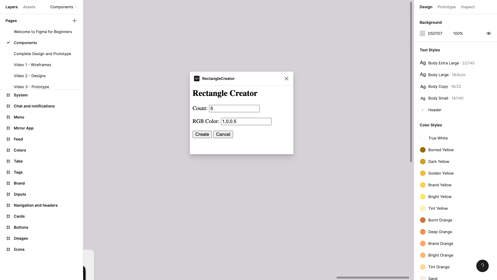

# Rectangle Creator

A quick intro to Figma Plugins.

    

## Features

- understanding the workflow to create a Figma plugin.
- sending user variables.
- customizing the background color.

Based on [Figma Plugins Docs](https://www.figma.com/plugin-docs/) (2022).
