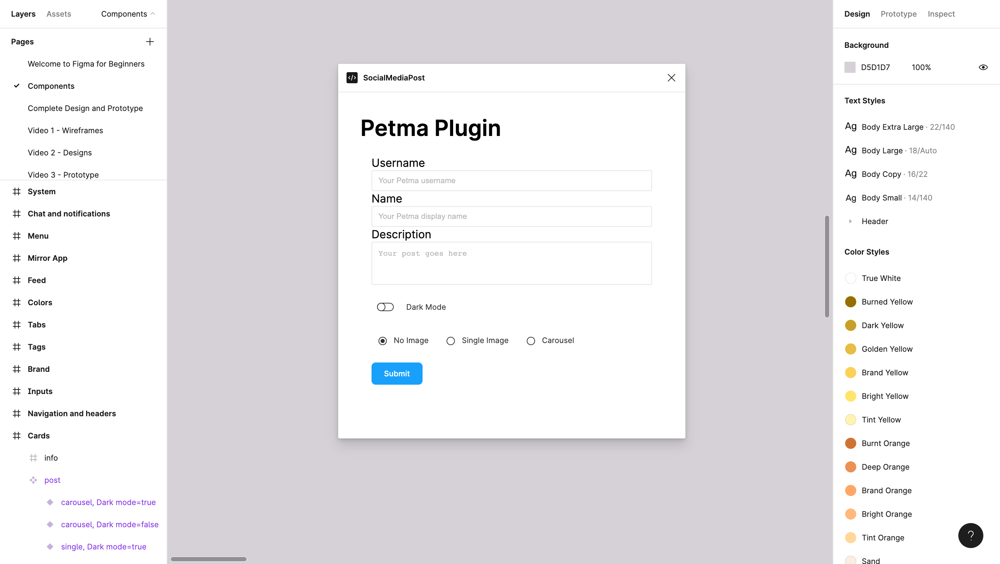

# Social Media Post

A plugin that creates a customizable post for a social media app design.

    

## Features

- building a UI with the Figma Plugin API.
- using [Tom Lowry's UI library](https://github.com/thomas-lowry/figma-plugin-ds).
- creating an instance of a variant from a [component set](https://www.figma.com/community/file/915647337333327091).
- taking user input and using it to create new components in a Figma file.
- adding a dark mode conditional.
- selecting the text nodes and overwriting the default text.
- randomizing comments and likes.
- adding the current time and date.
- handling scroll and zoom info view.
- sending a message from the plugin code to the UI.

Based on [Build your first plugin](https://www.youtube.com/playlist?list=PLXDU_eVOJTx5YBAszyuOTyxlgIxkQVyii) by Figma (2022).
