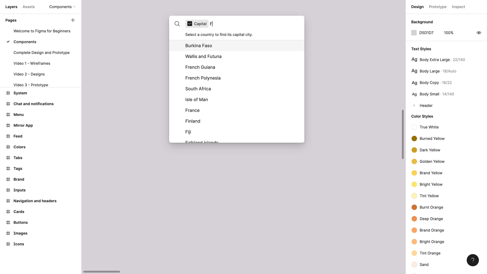

# Capital

A plugin that fetches countries from an API and displays the requested capital.

    

## Features

- creating an invisible iframe UI to use network API's.
- resolving the countries promise when a message is received from the iframe.
- showing a loading message.
- filtering suggestions based on the query entered.

Based on [Figma + FigJam Plugin Samples](https://github.com/figma/plugin-samples) by Figma (2022).
