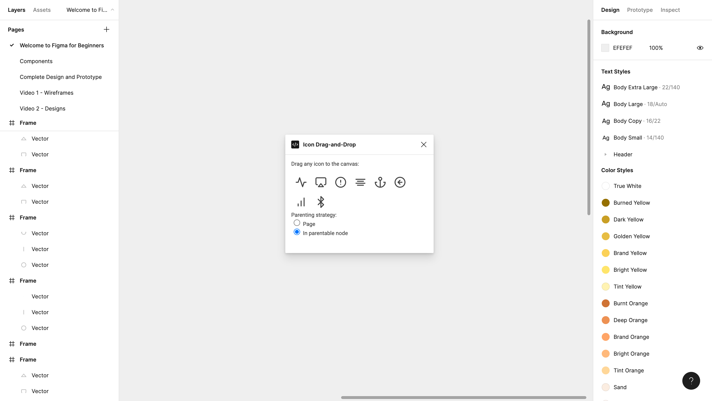

# Icon Drag-and-Drop

A simple icon library using drag-and-drop from a modal to the canvas.

    

## Features

- registering callbacks for drop events.
- communicating drop data from the plugin iframe.

Based on [Figma + FigJam Plugin Samples](https://github.com/figma/plugin-samples) by Figma (2022).
