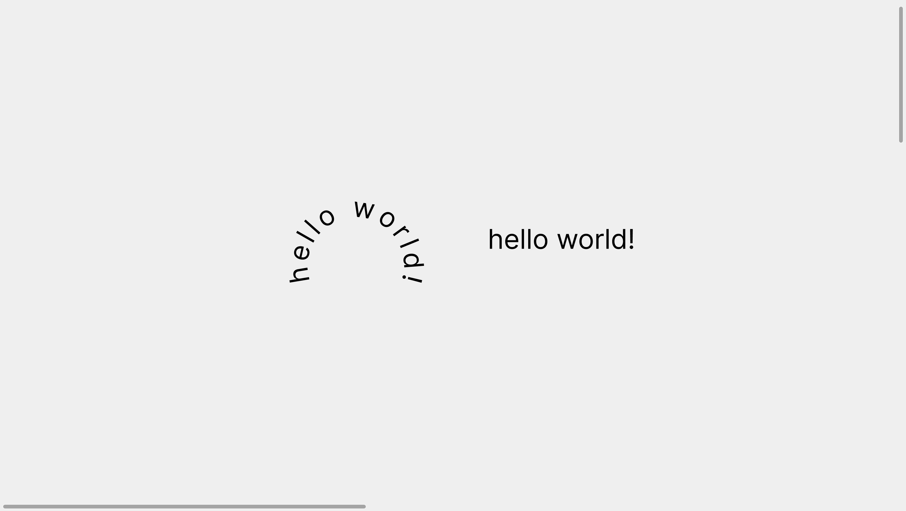

# Circle Text

A plugin that arranges characters in a circle.

    

## Features

- taking a single text node selected by the user.
- loading the font asynchronously.
- creating a copy.
- arranging the characters in a a circle.

Based on [Figma + FigJam Plugin Samples](https://github.com/figma/plugin-samples) by Figma (2022).
