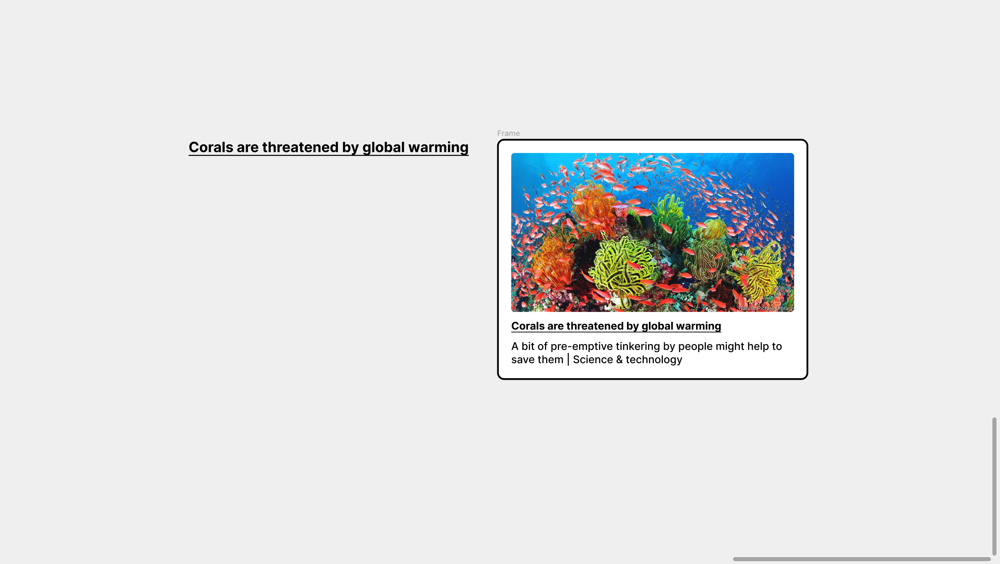

# Meta Cards

A plugin that adds link Metacards to the canvas.

    

## Features

- finding links within a text node.
- using the tags in the head of a webpage at the relative links.
- creating on canvas meta cards of an image, title, description and link.

Based on [Figma + FigJam Plugin Samples](https://github.com/figma/plugin-samples) by Figma (2022).
